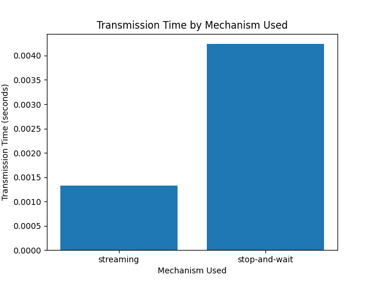

# PCD Homework 1 - Transmission Time Analysis

## Results
Here is a brief summary of the findings from the performance tests:

* The transmission time generally increases with the message size for both streaming and stop-and-wait mechanisms.

* The stop-and-wait mechanism has a longer transmission time compared to streaming, since it waits for an acknowledgement before sending the next message.

* UDP has generally lower transmission times compared to TCP, likely due to its simpler, connectionless protocol.

* TCP guarantees reliability, so it might be a better choice depending on the application.

* There is no significant difference between the number of sent and received bytes, which suggests that the transmission was successful and there was no data loss.

In terms of the options for the client/server, the program allows for the following:

* The user can choose between UDP and TCP protocols as parameters for both the client and server.

* The user can specify the message size, ranging from 1 to 65535 bytes.

* The program implements both streaming and stop-and-wait mechanisms, with the latter performing an acknowledgement before sending the next message.

