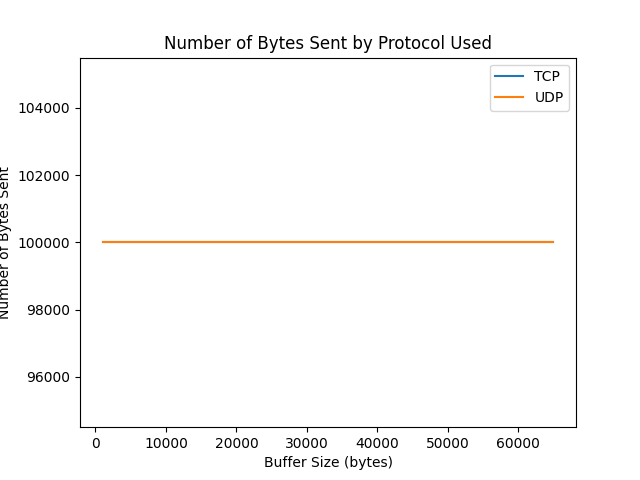

# PCD Homework 1 - Transmission Time Analysis

## Introduction
In this project, we investigate the transmission time of messages between a client and a server using different communication protocols and mechanisms. The goal is to determine which combination of protocol and mechanism provides the best performance for different message and buffer sizes.

## Setup
To conduct the experiments, we set up a client and a server on the same machine. The client sends messages to the server, and the server responds with an acknowledgement for stop-and-wait communication. The client and server both run Python scripts that use the socket library to implement the selected communication protocol and mechanism.

## Procedure
* First, the test script imports necessary modules and defines some functions that will be used throughout the script.
* The generate_message_sizes function creates a list of message sizes to test. It starts with a message size of 1 and multiplies it by 1.1 until the message size is 65535 or greater.
* The save_test_results function writes the test results to a CSV file.
* The run_tests function sets up the parameters for the test. It defines the protocols to use (UDP and TCP), the message sizes to test (generated by generate_message_sizes), and the mechanisms to use (streaming and stop-and-wait).
* The function then loops through each combination of protocol, message size, and mechanism, and runs a test. Each test consists of starting a send thread and a receive thread, passing the protocol, message size, and mechanism as arguments. Once the threads have finished, the test results (transmission time, number of sent bytes, and number of received bytes) are recorded in a list.
* Finally, the test results are written to a CSV file using the save_test_results function.

* The purpose of the test is to determine the transmission time of different protocols and mechanisms, with varying message sizes. The results of the test can be analyzed to determine which combination of protocol and mechanism is most suitable for a particular application and message size.

## Results
Here is a brief summary of the findings from the performance tests:

* The transmission time generally increases with the message size for both streaming and stop-and-wait mechanisms.

* The stop-and-wait mechanism has a longer transmission time compared to streaming, since it waits for an acknowledgement before sending the next message.

* UDP has generally lower transmission times compared to TCP, likely due to its simpler, connectionless protocol.

* TCP guarantees reliability, so it might be a better choice depending on the application.

* There is no significant difference between the number of sent and received bytes, which suggests that the transmission was successful and there was no data loss.

In terms of the options for the client/server, the program allows for the following:

* The user can choose between UDP and TCP protocols as parameters for both the client and server.

* The user can specify the message size, ranging from 1 to 65535 bytes.

* The program implements both streaming and stop-and-wait mechanisms, with the latter performing an acknowledgement before sending the next message.

## Conclusion

Using streaming as the primary option may appear to be the better choice, however, it is important to note that the test does not take into account the potential overflow of the server buffer and the possibility of losing data. In high-performance, critical applications, it is necessary to find a suitable compromise between the two options. 
